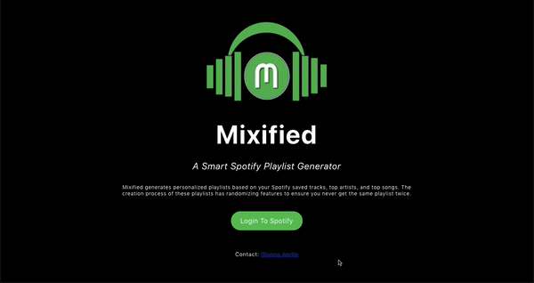

# Mixified
Try it out here! https://gianna-aprile.github.io/Mixified-React/  

## About Mixified
***A Smart Spotify Playlist Generator***  
Mixified generates personalized playlists based on your Spotify saved tracks, top artists, and top songs. The creation process of these playlists has randomizing features to ensure you never get the same playlist twice.   

---
## Technology Used
Mixified React Repo: https://github.com/gianna-aprile/Mixified-React  
Mixified API/Backend Repo: https://github.com/gianna-aprile/Mixified-Flask

Mixified is a React webapp that is optimized for viewing on both computers and smaller devices. Once a user requests to create a playlist, the React app sends the user's Spotify authorized token to the Python Flask app through the Mixified API. The backend then performs carefully thought out algorithms that curate a smart, personalized playlist for the user, ensuring that the same playlist never gets created twice. 

---
## Mixified Features 
Currently, Mixified has 12 unique playlist generators running. You can find out more information about each playlist type below.

* ***Top Artists*** - Discover more artists related to artists you already love. This playlist will contain songs that are related to the tracks of your top 50 artists.

* ***Recent Artists*** - Find more artists related to your newest saved songs. This playlist will contain artists related to the artists of your most recently saved tracks.

* ***Top Tracks*** - Discover more songs related to your favorite tracks. This playlist will contain songs related to your top 50 most played tracks.

* ***Pop*** - Explore the pop genre. This playlist will contain pop songs that are similar to the most recent pop songs saved in your library.

* ***Hip Hop*** - Explore the hip hop genre. This playlist will contain hip hop songs that are similar to the most recent hip hop songs saved in your library.

* ***Rap*** - Explore the rap genre. This playlist will contain rap songs that are similar to the most recent rap songs saved in your library.

* ***R&B*** - Explore the R&B genre. This playlist will contain R&B songs that are similar to the most recent R&B songs saved in your library.

* ***EDM*** - Explore the EDM genre. This playlist will contain EDM songs that are similar to the most recent EDM songs saved in your library.

* ***House*** - Explore the house genre. This playlist will contain house songs that are similar to the most recent house songs saved in your library.

* ***Country*** - Explore the country genre. This playlist will contain country songs that are similar to the most recent country songs saved in your library.

* ***Alternative*** - Explore the alternative genre. This playlist will contain alternative songs that are similar to the most recent alt. songs saved in your library.

* ***Rock*** - Explore the rock genre. This playlist will contain rock songs that are similar to the most recent rock songs saved in your library.

---
## Future Steps
More playlist generator options are on the way, stay tuned!   

If you would like to submit an idea for a playlist type, send an email to me giannaaprile@outlook.com and I'll do my best to make it happen!